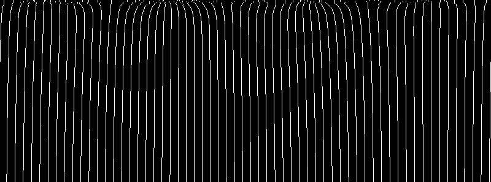

## circle.diderot: Mutually-repelling particles on a unit circle

This example computes a system of mutually-repelling particles constrained to
the unit circle. The particles are initialized from a given sequence of a
2-vectors, and each update tries to move each particle to a lower potential
energy, as determined by looking at nearby particles.  As in the
[`life.diderot`](../life) example that introduced strand communication, the
special strand variable named `pos` indicates the particle position, and the
computation is monitored via a `global` update method. Like
[`sieve.diderot`](../sieve), this program computes global reductions in the
global update, used here to compute the coefficient-of-variation of nearest
inter-particle distances, as the basis of a geometric test of convergence.

Like the [`life.diderot`](../life) example, we use snapshots to inspect
the system state as it progresses, so we compile with:

	diderotc --snapshot --double --exec circle.diderot

When compiling with `--double`, Diderot represents the `real` type
as a `double` in C++, instead of the default `float`, which produces
more accurate results.

The following creates a list of `N` randomly oriented unit-length 2-vectors in
`vec2.nrrd` which will be the initial input.  Setting the random number seed
of `unu 1op nrand` with `-s $RNG` ensures reproducible results (or you can
leave that out to give different results each time).

	N=60
	RNG=42
	eval echo {1..$((2*N))} | unu reshape -s 2 $N | unu 1op nrand -s $RNG -o vec2.nrrd
	unu project -i vec2.nrrd -a 0 -m l2 | unu axinsert -a 0 -s 2 | unu 2op / vec2.nrrd - -o vec2.nrrd

Then to run with snapshots saved every iteration (`-s 1`), but limiting the program
to 500 iterations (`-l 500`), as well as cleaning results from previous run:

	rm -f pos-????.nrrd pos.nrrd
	./circle -s 1 -l 500

If this fails with `ERROR: unexpected arg (or unrecognized flag): "-s"`, it means that
`circle` wasn't compiled with `--snapshot`, as above.  It should converge in under
500 iterations, producing many `pos-????.nrrd` files, which we can post-process with:

	unu join -i pos-????.nrrd -a 2 | # stack snapshots along new axis
	  unu dice -a 0 -o ./ # get all x,y values in {0,1}.nrrd
	unu 2op atan2 0.nrrd 1.nrrd | # scanlines are lists of per-particle angles
	  unu histax -a 0 -min -pi -max pi -b 800 | # scanlines are angle histograms
	  unu quantize -b 8 -min 0 -max 1 -o angles.png

  
[angles.png](ref/angles.png)

This produces `angles.png` by unrolling (with atan2) positions along the circle,
and laying these out along horizontal scanlines, one per iteration. It is clear that the
particle interactions made a roughly uniform distribution early on, but
subsequent refinements took longer. Scrutinizing the top of the image shows
where strands were stationary either because they repeatedly backtracked in the
Armijo line search (until they found a step size that led to a sufficient
energy decrease), or because they had no other particles to interact with.

Some experiments that can be tried with this example:
* If `--double` is removed from the compilation, the system may not converge to the default `eps` before the iteration limit, due to the decrease in numerical accuracy.
* There are different possible inter-particle potentials `phi` (uncomment one at a time), which can lead to different dynamics and different convergence speed towards a uniform distribution.
* If the interaction radius `rad` is decreased while maintaining the number of particles, gaps may form.
* Increasing radius `rad` will tend to force convergence faster, at the expense of computing more particle interactions.
* There are constants associated with Armijo line search, changing them may lead to faster convergence.

