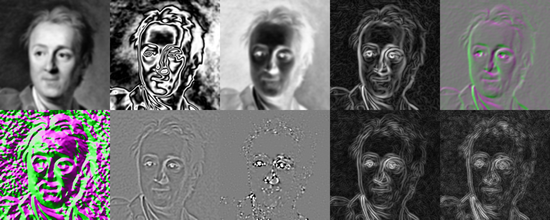
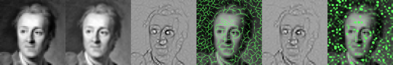

# dprobe: image probing utility

This is a conceptual peer to the `vprobe` and `gprobe` utilities in
Teem (which probe various quantities on 3-D fields reconstructed by
convolution), except that `dprobe` works on 1-D and 2-D data, and permits
probing any expression in a field Diderot knows how to compute.  Run

	./dprobe --help

to get the detailed usage information.

This is an atypical Diderot example because it is not a single program, but a
generator/compiler (written in Python) for Diderot programs, according to the
various command-line options to `dprobe`.  The other example most similar to
this is [`vimg`](../vimg), but that only knows about 2-D scalar data, and
only knows how to compute one of a preset number of expressions.  The
variety of things that `dprobe` can do requires generating new
programs, because currently various elements and properties of Diderot
programs must be known at compile time (rather than run-time):

* The input image dimension
* (Tensor) shape of values in input image (e.g. `[]` for `real` or `[3]` for `vec3`)
* Whether to use any border control on an image, or which one to use (e.g. `clamp`, `wrap`, `mirror`)
* The reconstruction kernel
* The mathematical expressions involving fields that must be evaluated (e.g. `F(x)` vs `|∇F(x)|`)
* The differentiability requirement of a field for some expression involving that field
(e.g. `field#0` if no derivatives needed, vs `field#2` if two derivatives are needed)
* The (tensor) shape of the program's output values
* Whether output should a list (from a strand collection) or an array (from a strand grid)

While future versions of Diderot may permit learning some of these things at
run-time, fundamental things (like whether to run as a collection
versus a grid of strands) will probably always need to be set at compile-time.
This isn't a big limitation: real-world uses of Diderot **should** be specialized
on the forms of data to be processed and generated. `dprobe` does include
a single template program (see `TEMPLATE` at
the top of `dprobe`), which is transformed according to the arguments to
`dprobe`, but it is so heavily transformed that it doesn't really look like a
Diderot program. You can see the final generated program by specifying its
basename with the `-op` option, or otherwise using the `-kg` option to keep
generated files.

A simple example of using `dprobe` to probe 2-D data at a single point:

	./dprobe -i ../data/ddro-100.nrrd -k real -kern bspln5 -bc clamp -q real F 0 -d -pp 0.2 0.4

This convolves the scalar (`-k real`) 100x100 Diderot portrait (`-i
../data/ddro-100.nrrd `) by with quintic B-spline kernel (`-kern bspln5`) to
make a field (which is always called `F`), with `clamp` border control.  At
the single position `[0.2,0.4]`, the program evaluates the `real`-valued `F`,
which requires 0 derivatives (`-q real F 0`), and prints the results
(`0.5355935654392312`).  You can run the above command with `-v` to get
information about what was actually done, or with `-v 2` to see how the
template program was transformed.

We can also sample at some list of locations saved in a file (`pi.txt`). We print
results to terminal below, but could also give a filename for `-o`:

	printf "0 0\n-0.3 0.5\n0.2 -0.8\n1.2 0.7\n0.1 -3" > pi.txt
	cat pi.txt
	./dprobe -i ../data/ddro-100.nrrd -k real -kern bspln5 -bc clamp -q real F 0 -d -pi pi.txt -o - | unu save -f text

To take a 1-D slice of the data, we set up a sampling grid for `-pg`:

	printf "1 -1 -0.5\n501 0.004 0.002\n" > pg.txt
	cat pg.txt
	./dprobe -i ../data/ddro-100.nrrd -k real -kern bspln5 -bc clamp -q real F 0 -d -pg pg.txt -o line.nrrd

The `pg.txt` file specifies a sampling grid (in a 2-D array) the same as is
used by Teem's `gprobe`. On the first row, the first number (interpreted as
an int) is the grid dimension, and the next numbers are the location of the
first sample. Each subsequent row specifies one axis of the grid, from fast
to slow raster order: the first number in the row (again interpreted as an
int) is the number of samples on that axis, and the remaining numbers are the
increment in space between adjacent samples on that axis.  The `pg.txt` file
above specifies a diagonal line that cuts through the center of the image.
We can plot the values sampled along it:

	unu dhisto -i line.nrrd -h 200 -nolog |
	  unu pad -min -1 -1 -max M+1 M+1 -b pad -v 0 -o line-plot.png

  
[line-plot.png](ref/line-plot.png)

To sample on same 2-D grid as the image:

	./dprobe -i ../data/ddro-100.nrrd -k real -kern bspln5 -bc clamp -q real F 0 -d -o ddro-bsp5.nrrd

To compare the original image and the resampling, we upsample (with `unu`) just to make
the individual pixels clearer:

	unu join -i ../data/ddro-100.nrrd ddro-bsp5.nrrd -a 0 |
	  unu resample -s x4 x4 -k box |
	  unu quantize -b 8 -o compare.png

  
[compare.png](ref/compare.png)

The `bspln5` kernel has done some smoothing; other kernels (like `tent` and `ctmr`)
are interpolating.
Note that the location in space of the output `ddro-bsp5.nrrd` is the same (modulo some
floating point roundoff) as the input image:

	unu head ../data/ddro-100.nrrd ddro-bsp5.nrrd

The sampling of the field can be on a higher-resolution grid, allowing us to
see structure between pixels.  In the following examples, the query expression
is often quoted, to avoid confusing the shell with `|` or `(`.  The quantities
measured are described in comments (`uq8` and `wpad` aliases help with brevity).

	PARM="-i ../data/ddro-100.nrrd -k real -kern bspln5 -bc clamp -s x4 x4 -d -o -"
	alias uq8="unu quantize -b 8"; alias wpad="unu pad -min -1 0 0 -max M M M -b wrap"
	./dprobe $PARM -q real        F         0 | uq8 -o ddro-val.png  # scalar values
	./dprobe $PARM -q real   "sin(8*π*F)"   0 | uq8 -o ddro-sin.png  # sin waves
	./dprobe $PARM -q real     "(-1)*F"     0 | uq8 -o ddro-neg.png  # negated values
	./dprobe $PARM -q real      "|∇F|"      1 | uq8 -g 1.5 -o ddro-gmag.png # grad mag
	./dprobe $PARM -q vec2        ∇F        1 | wpad | uq8 -o ddro-gvec.png # grad vec
	./dprobe $PARM -q vec2 "normalize(∇F)"  1 | wpad | uq8 -o ddro-gdir.png # grad dir
	./dprobe $PARM -q real  "trace(∇⊗∇F)"   2 | uq8 -o ddro-htrc.png  # trace of Hessian
	./dprobe $PARM -q real   "det(∇⊗∇F)"    2 | uq8 -min 0.5% -max 0.5% -o ddro-hdet.png # determinant of Hessian
	./dprobe $PARM -q real     "|∇⊗∇F|"     2 | uq8 -g 1.5 -o ddro-hnrm.png # Frobenius norm of Hessian
	./dprobe $PARM -q real  "|∇(|∇⊗∇F|)|"   3 | uq8 -g 2 -o ddro-hngm.png   # mag of grad of Frob norm of Hessian

The third example (`-q real "(-1)*F 0`) illustrates an [annoyance in python's
`argparse`](https://docs.python.org/3/library/argparse.html#arguments-containing),
involving option arguments starting with `-`. Using `-q real -F 0`
would lead to an error `dprobe: error: argument -q: expected 3 arguments`, because
the `-F` is interpreted as starting a new option.  Even though `-F` is valid field
operation in Diderot, `(-1)*F` is used to avoid the `argparse` annoyance.

This makes [an image](ref/ddro-probes.png) showing the 10 results above in scan-line order
(some awkwardness from first making gray-scale images into RGB):

	unu join -i ddro-{val,sin,neg,gmag,htrc,hdet,hnrm,hngm}.png -a 2 |
	  unu axinsert -a 0 -s 3 | unu dice -a 3 -o ./
        unu join -i {0,1,2,3,ddro-gvec,ddro-gdir,4,5,6,7}.png -a 3 |
	  unu tile -a 3 1 2 -s 5 2 -o ddro-probes.png
	unu resample -i ddro-probes.png -s = 800 a -o ddro-probes-sm.png
	rm -f {0,1,2,3,4,5,6,7}.png

  
[ddro-probes.png](ref/ddro-probes.png)

In all the cases above, the second part of the `-q` query is an expression of
field `F` that works because of how Diderot "lifts" tensor operators (`det`,
`trace`, `inv`) to tensor fields, so the query is itself another field, and
the field is evaluated at position `xx` by suffixing the field with `(xx)`.
Currently, however, not all tensor operations have been lifted to fields,
such as learning eigensystems (`evals` and `evecs`).  When using these
operations, we
need to explicitly include `(xx)` in the query expression to indicate field
evaluation, and then operate on the (non-field) result:

	unu resample -i ../data/ddro.nrrd -s 45 45 -k tent | # make lo-res
	  unu resample -s x1 x1 -k bspln5ai -o ddro-lopf.nrrd # pre-filter for bspln5
	alias uq8="unu quantize -b 8"
	unu resample -i ddro-lopf.nrrd -s x1 x1 -k bspln5 | # interpolates lo-res
	  unu resample -s 450 450 -k box | # upsample for display
	  uq8 -o lo-box.png
	PARM="-i ddro-lopf.nrrd -k real -kern bspln5 -bc clamp -s 450 450 -d -o -"
	./dprobe $PARM -q real           F          0 | uq8 -o lo-val.png  # scalar values
	./dprobe $PARM -q real "evals(∇⊗∇F(xx))[1]" 2 | uq8 -o lo-evl1-good.png # smaller Hessian eval
	./dprobe $PARM -q real "evals(∇⊗∇F(xx))[1]" 2 -s x1 x1 | unu resample -s 450 450 | uq8 -o lo-evl1-bad.png

The difference between [`lo-evl1-good.png`](ref/lo-evl1-good.png) (Hessian eigenvalues computed from high-res sampling of field)
and [`lo-evl1-bad.png`](ref/lo-evl1-bad.png) (Hessian eigenvalues pre-computed on image, then upsampled) show how
Diderot's approach to field reconstruction may offer particular value for extracting features that are near
the limits of the imaging resolution. This difference is clearer with an illustration of
[ridge lines](https://en.wikipedia.org/wiki/Ridge_detection).

	PARM="-i ddro-lopf.nrrd -k real -kern bspln5 -bc clamp -s 450 450 -d -o -"
	RIDGE="(1-|evecs(∇⊗∇F(xx))[1]•normalize(∇F(xx))|)*max(0,-evals(∇⊗∇F(xx))[1]/|∇F(xx)|)"
	alias uq8="unu quantize -b 8 -max 3%"
	./dprobe $PARM -q real "$RIDGE" 2 | uq8 -o lo-ridge-good.png
	./dprobe $PARM -q real "$RIDGE" 2 -s x1 x1 | unu resample -s 450 450 | uq8 -min 0 -o lo-ridge-bad.png
	echo 90 255 90 > green
	for X in bad good; do
	   unu axinsert -i lo-ridge-$X.png -a 0 -s 3 | unu 2op / - 255 -t float -o lerp.nrrd
	   unu axinsert -i lo-box.png -a 0 -s 3 | unu 2op x - 0.7 | unu 3op lerp lerp.nrrd - green -w 1 -o lo-ridge-box-$X.png
	done
	rm -f green gray.png lerp.nrrd

The `RIDGE` expression looks at the alignment of the second eigenvector (associated with the more
negative eigenvalue) `evecs(∇⊗∇F(xx))[1]` and the unit-length gradient direction `normalize(∇F(xx))` (or `∇F(xx)/(|∇F(xx)|)`),
scaled by a measure of ridge strength `-evals(∇⊗∇F(xx))[1]/|∇F(xx)|`.  The difference between
[`lo-ridge-box-good.png`](ref/lo-ridge-box-good.png) and [`lo-ridge-box-bad.png`](ref/lo-ridge-box-bad.png)
further highlights how poorly ridge detection works on a per-pixel basis.  Composing all the pieces:

	unu join -i lo-{box,val,evl1-good,evl1-bad}.png -a 2 |
	  unu axinsert -a 0 -s 3 | unu dice -a 3 -o ./
	unu join -i {0,1,2,lo-ridge-box-good,3,lo-ridge-box-bad}.png -a 1 -o ddro-ridge.png
	unu resample -i ddro-ridge.png -s = 800 a -o ddro-ridge-sm.png
	rm -f {0,1,2,3}.png

  
[ddro-ridge.png](ref/ddro-ridge.png)

If we transform the `RIDGE` expression above by replacing `F` with `(|∇F|)`,
we can look at **ridges of gradient magnitude**, a kind
of [edge
detection](https://en.wikipedia.org/wiki/Ridge_detection#Relations_between_edge_detection_and_ridge_detection)
expressed in `GMRIDGE` below.  For comparison, `CANNY` expresses Canny edge detection:
the gradient magnitude is at a maximum with respect to motion along gradient direction.  For visual
clarity, both expressions are weighted by the gradient magnitude to suppress edges in the background.

	PARM="-i ddro-lopf.nrrd -k real -kern bspln5 -bc clamp -s 450 450 -d -o -"
	alias uq8="unu quantize -b 8 -max 1%"
	GMRIDGE="(1-|evecs(∇⊗∇(|∇F|)(xx))[1]•normalize(∇(|∇F|)(xx))|)*max(0,-evals(∇⊗∇(|∇F|)(xx))[1]/|∇(|∇F|)(xx)|)*|∇F(xx)|"
	CANNY="(1-|normalize(∇F(xx))•normalize(∇(|∇F|)(xx))|)*(1 if normalize(∇F(xx))•(∇⊗∇(|∇F|))(xx)•normalize(∇F(xx)) < 0 else 0)*|∇F(xx)|"
	./dprobe $PARM -q real "$GMRIDGE" 3 | uq8 -o lo-gmridge.png
	./dprobe $PARM -q real "$CANNY" 3 | uq8 -o lo-canny.png
	echo 90 255 90 > green
	for X in gmridge canny; do
	   unu axinsert -i lo-$X.png -a 0 -s 3 | unu 2op / - 255 -t float -o lerp.nrrd
	   unu axinsert -i lo-box.png -a 0 -s 3 | unu 2op x - 0.7 | unu 3op lerp lerp.nrrd - green -w 1 -o lo-$X-box.png
	done
	rm -f green gray.png lerp.nrrd

Putting these side-by-side (first |∇F| ridges, then Canny edges):

	unu join -i lo-{box,val}.png -a 0 |
	  unu axinsert -a 0 -s 3 |
	  unu join -i - lo-{gmridge,canny}-box.png -a 1 -o ddro-edge.png
	unu resample -i ddro-edge.png -s = 800 a -o ddro-edge-sm.png

  
[ddro-edge.png](ref/ddro-edge.png)

The `RIDGE`, `GMRIDGE`, and `CANNY` expressions above could be expressed more concisely with new field definitions
(e.g. `G = |∇F|`) and variables (e.g. `n = normalize(∇F(xx))`). GLK hopes to do this soon.
